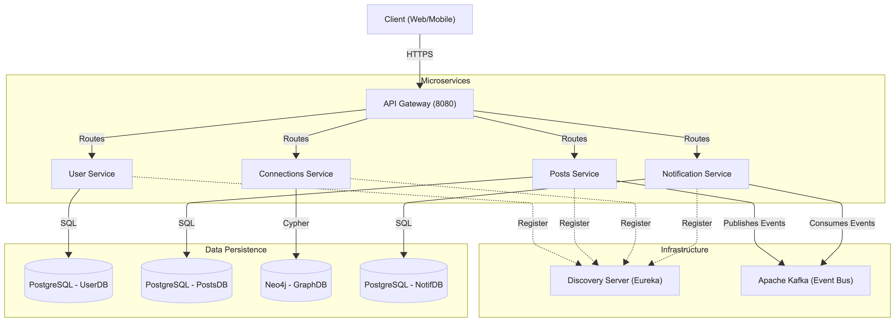
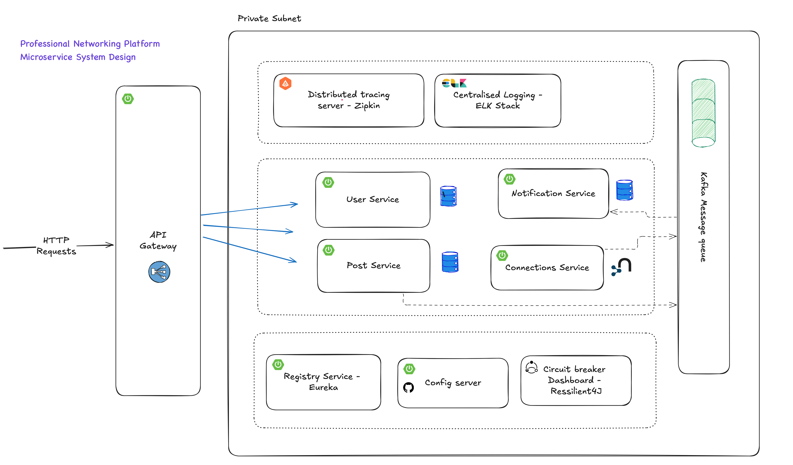
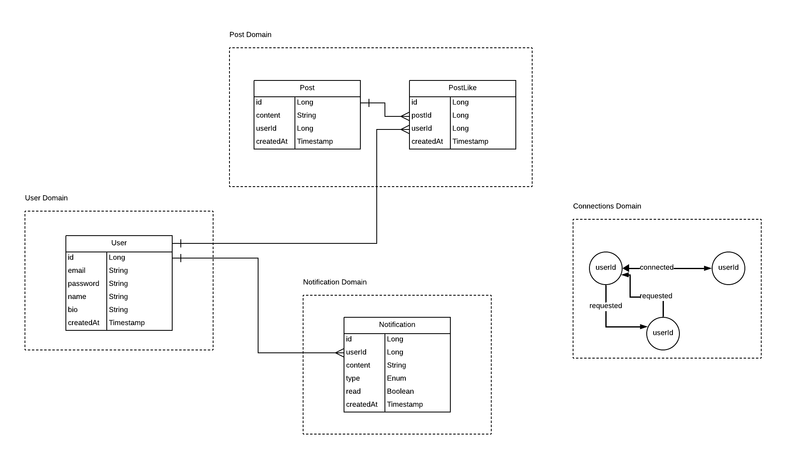
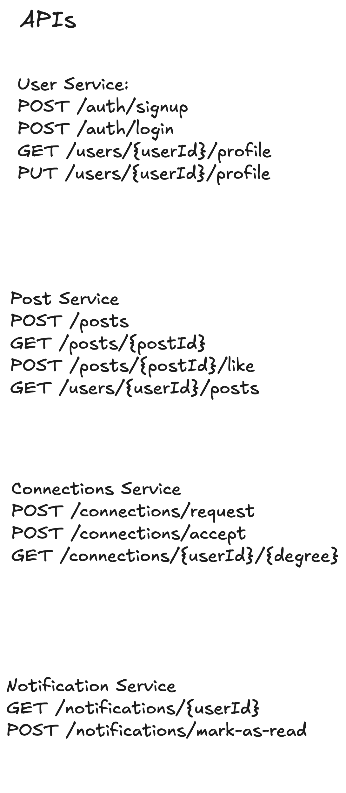

# Professional Networking Platform (Backend)

Welcome to the **Professional Networking Platform** backend repository. This project is a scalable, microservices-based application inspired by platforms like LinkedIn. It demonstrates modern distributed system patterns, including service discovery, API gateway routing, event-driven architecture with Kafka, and graph database interactions for managing social connections.

## 🚀 System Design

The system is designed with a robust microservices architecture, ensuring scalability and fault tolerance.



### Microservices Overview

The following diagram illustrates the interaction and design of the microservices.



| Service | Port | Description | DB / Tech |
| :--- | :--- | :--- | :--- |
| **`discovery-server`** | `8761` | Service Registry using **Netflix Eureka**. Allows services to find each other dynamically. | N/A |
| **`api-gateway`** | `8080` | Entry point. Handles **JWT Authentication**, routing, and load balancing. | Spring Cloud Gateway |
| **`user-service`** | `8081`* | Manages user identity, profiles, and authentication (Signup/Login). | PostgreSQL |
| **`posts-service`** | `8082`* | Handles post creation, feed retrieval, and interactions (likes/comments). | PostgreSQL, Kafka Producer |
| **`connections-service`** | `8083`* | Manages social graph (Follow/Connect). Uses Graph algorithms for "First Degree" connections. | **Neo4j** |
| **`notification-service`** | `8084`* | Real-time notifications system listening to Kafka events. | PostgreSQL, Kafka Consumer |

> *Note: Downstream service ports are managed by Eureka and may vary in non-docker setups, but these are typical defaults or container ports.*

## ✨ Key Features

-   **🔐 Secure Authentication**: Centralized JWT generation and validation via the API Gateway and User Service.
-   **🕸️ Social Graph**: Leverages **Neo4j** to efficiently query complex relationships (e.g., "users you might know", "first-degree connections").
-   **📨 Event-Driven Notifications**: Asynchronous processing of events (e.g., `PostCreated`, `PostLiked`) using **Apache Kafka** to decouple services and ensure high performance.
-   **🛣️ Dynamic Routing**: Spring Cloud Gateway + Eureka ensures requests are always routed to healthy service instances.
-   **📊 Observability Ready**: Integrated with **Spring Boot Actuator** and ready for **ELK Stack** (Elasticsearch, Logstash, Kibana) for centralized logging and monitoring.

## 🛠️ Tech Stack & Database Design



-   **Language**: Java 21
-   **Framework**: Spring Boot 3.3.4, Spring Cloud 2023.0.3
-   **Databases**: 
    -   **PostgreSQL**: For structured relational data (Users, Posts).
    -   **Neo4j**: For graph-based relationship interactions.
-   **Messaging**: Apache Kafka
-   **Build Tool**: Maven
-   **Containerization**: Docker, Docker Compose
-   **Orchestration**: Kubernetes (Manifests available in `/k8s`)

## ⚙️ Getting Started

### Prerequisites

-   **Java 21** SDK
-   **Docker** & **Docker Compose**
-   **Git**

### ⚡ Quick Start (Docker Compose)

The easiest way to run the entire system is using Docker Compose.

1.  **Clone the repository:**
    ```bash
    git clone https://github.com/ARYANKUMAR1/Professional-Networking-Platform.git
    cd Professional-Networking-Platform
    ```

2.  **Build the artifacts (Optional if images are local):**
    ```bash
    # You might need to skip tests if infrastructure isn't running
    ./mvnw clean package -DskipTests
    ```
    *Note: The `docker-compose.yml` pulls pre-built images from Docker Hub by default. If you want to use local code, you'll need to build the images using `jib:dockerBuild` or standard Dockerfile builds.*

3.  **Start the infrastructure:**
    ```bash
    docker-compose up -d
    ```
    This command starts:
    -   Zookeeper & Kafka
    -   PostgreSQL databases (User, Posts, Notification)
    -   Neo4j Database
    -   Discovery Server
    -   All Microservices

4.  **Verify Status:**
    -   **Eureka Dashboard**: [http://localhost:8761](http://localhost:8761) - Check if all services are registered (UP status).
    -   **Kafka UI** (if configured): [http://localhost:8090](http://localhost:8090)

### 💻 Manual Setup (Local Development)

If you prefer running services individually in your IDE:

1.  **Start Infrastructure**:
    You still need the databases and Kafka.
    ```bash
    docker-compose -f docker-compose.base.yml up -d
    ```
    *(Ensure `docker-compose.base.yml` contains only the DBs and Kafka, or remove service entries from the main `docker-compose.yml` before running)*.

2.  **Run Services/Configs**:
    -   Start **Discovery Server** first.
    -   Start **API Gateway**.
    -   Start **User**, **Posts**, **Connections**, **Notification** services.
    -   *Ensure your `application.properties/yml` in each service points to `localhost` for DBs if running outside Docker network.*

## 📚 API Documentation

### API Design


Each service comes with SpringDoc (Swagger/OpenAPI). You can access the API documentation for individual services (via Gateway if configured, or direct port):

-   **User Service**: `http://localhost:8081/swagger-ui.html`
-   **Posts Service**: `http://localhost:8082/swagger-ui.html`
-   **Gateway Aggregation**: Access `http://localhost:8080/swagger-ui.html` (if aggregation is configured).

### Sample Endpoints

-   **Auth**: `POST /auth/signup`, `POST /auth/login`
-   **Posts**: `GET /core/posts`, `POST /core/posts`
-   **Connections**: `POST /core/connections/request/{userId}`

## 📂 Project Structure

```bash
Professional-Networking-Platform/
├── api-gateway/            # Routing & Security
├── discovery-server/       # Eureka Registry
├── user-service/           # User logic
├── posts-service/          # Feed & Posts logic
├── connections-service/    # Graph DB & Friends logic
├── notification-service/   # Kafka Consumer for alerts
├── uploader-service/       # File uploads
├── k8s/                    # Kubernetes manifests
├── docker-compose.yml      # Docker orchestration
└── README.md               # You are here
```

## 🤝 Contributing

1.  Fork the repository.
2.  Create a feature branch (`git checkout -b feature/amazing-feature`).
3.  Commit your changes (`git commit -m 'Add some amazing feature'`).
4.  Push to the branch (`git push origin feature/amazing-feature`).
5.  Open a Pull Request.
